# Monetary Incentive Delay (MID) Analysis 

This repository contains analysis code and results examining behavioral and physiological responses during a parametric version of the Monetary Incentive Delay (MID) task. 
* The primary focus of the physiological analysis is on event-aligned physiological dynamics (cardiac inter-beat interval (IBI)) and their relationship to task structure, reward anticipation, and performance.
* The primary focus of the behavioral analysis is on the reaction time, and other task-related performance metrics such as proportion of trials win pWin, proportion of Early Hit trials, and earnings.

## Task Structure 
Participants completed a parametric Monetary Incentive Dealy (MID) task designed to probe reward anaticipation and outcome processing under varying incentive conditions. 
Each trial began with a cue that indicated incentive valence (potential to gain money or lose money on the upcoming trial) and magnitude ($1, $3, $5, $7, $9), followed by an anticipation period that would vary in duration per trial, a target response window, and outcome feedback. 

* participants completed 4-task runs consisting of 45 trials each (180 total trials) inside the fMRI scanner
  * participants saw 90 potential gain trials and 90 potential loss trials and saw each of the 10 cues 18 times across the task
  * runs 1 and 2 were completed back to back followed by some structural scans and then runs 3 and 4 were completed back to back

### Cue Structure
* The task included 10 distinct cue types:
  * 5 gain cues, signaling the opportunity to win a reward if the target was successfully hit.
  * 5 loss cues, signaling the risk of losing an amount if the target was missed.
* Incentive magnitudes were 1, 3, 5, 7, and 9 dollars, matched across gain and loss conditions

This parametric design enables examination of graded physiological and behavioral responses to both incentive valence (gain vs. loss) and magnitude.

### Trial Structure
* Cue period – indicates incentive valence (gain/loss) and magnitude
* Fixation / anticipation period – counterbalanced across runs to be either (1s, 1.5s, 2s, 2.5s, 3s, 3.5s, 4s, 4.5s, or 5s)
* Target response window – participant attempts to respond within a time limit
  * Target is calibrated so that participants are successful in hitting the target ~66% of the time
* Feedback period - outcome displayed (win or loss)
* Inter-trial interval - counterbalanced across runs to be either 2s, 4s, or 6s
This structure supports event-aligned analyses of anticipation and outcome-related behavioral and physiological dynamics.

# Data 
### Physiological Data
Included in the data folder is a sample cleaned IBI dataset from one run. This type of file was fed into the physio analysis pipeline and contains the HR peaks during the run

Physiological analyses were conducted on cardiac inter-beat interval (IBI) data derived from physiological recordings collected during fMRI scanning.

For each participant and run, peak times corresponding to detected heartbeats were extracted following preprocessing. Inter-beat intervals were computed as the time difference between successive detected peaks and served as the primary physiological signal for analysis.

IBI time series were then:
	*	aligned to task event onsets (cue onset and target onset for individual each trial)
	*	segmented into event-locked windows
	*	time-binned at 100 ms resolution
	*	baseline-normalized where appropriate so that % change from baseline was analyzed rather than raw IBI -- this made analyses more comparable at the group level

### Behavioral Data 
Behavioral data consist of trial-level task performance and task parameters for each participant and run.

Key variables used in analysis included:
* Cue Type
* Fixation Duration
* Calibration
* **Reaction Time**
* **IsWin** -- indicates if the target in that trial was successfully hit or not
* Cumulative Block Total
* Trial timing information (cue and target onset times)

# Physiological Analysis 

## Cue Aligned Analysis Results:

### How does IBI dynamically change around cue presentation in the MID task?
* there is slight cardiac slowing after cue presentation which reflects the anticipatory response as participants wait for the target window
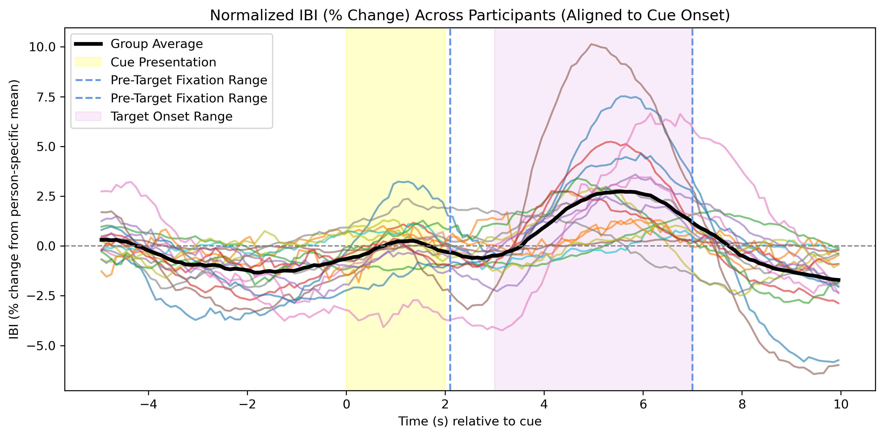

### Is the IBI timecourse consistent across runs?
* The shape of the timecourse remained consistent across runs
* IBI per trial tended to be greater as the task continued on -- this makes sense as the participants started to feel more settled in the scanner and less nervous
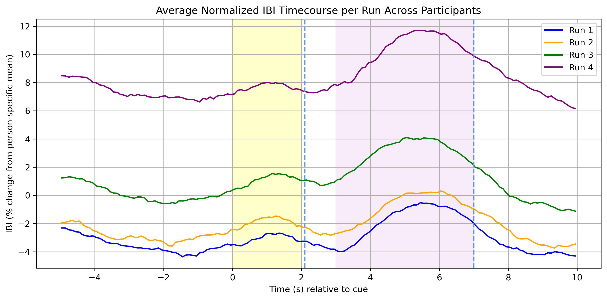

### How different is average IBI different across runs? 
* Mean IBI increases across runs as participants feel more comfortable in the scanner and with the task

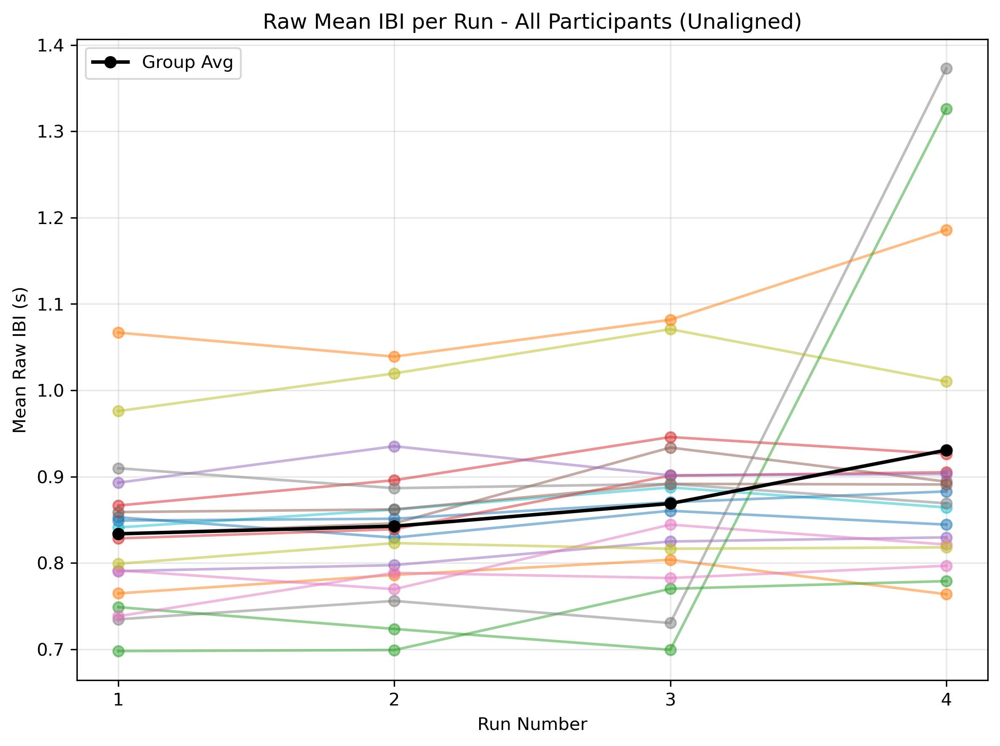

### Do participants' IBI timecourses differ between potential gain and loss trials?
* The IBI timecourse (averaged across participants) is consistent when presented with potential gain or potential loss cue types

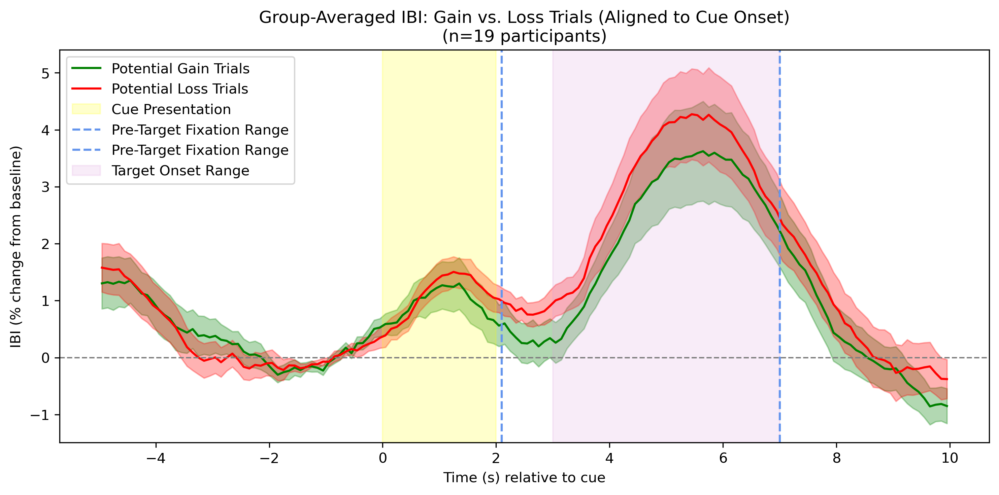

The t-test tests if there is statistically significant difference between the mean IBI in the two different conditions. The t-tests suggest that there is no statistically significant in the mean IBI between gain and loss trials in the 2s cue presentation window, nor in the 1s of guaranteed pre-target fixation time in each trial
* Gain vs Loss IBI During Cue Presentation: t(18) = -0.533, p = 0.601
* Gain vs Loss IBI During the First Second of the Fixation Period: t(18) = -1.862, p = 0.079

### Do participants' IBI timecourses differ between small and large trial types? 

The plots suggest there is not a big difference in the IBI changes during cue presentation between the small trials (magnitude 1 dollar and 3 dollar) vs the large trials (magnitude7 dollars and 9 dollars). It is worth noting that the IBI timecourse more steeply declines with the large trials during the 1s anticipation period. 
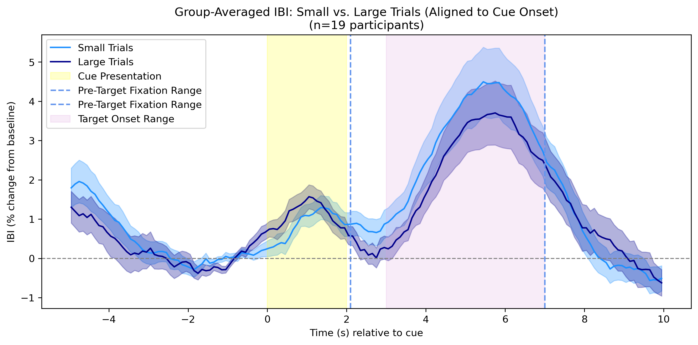

The paired t-test suggests that there are differences between the two groups but not yet at a statistically significant level. 
* Gain vs Loss IBI During Cue Presentation: t(18) = 1.326, p = 0.202
* Gain vs Loss IBI During the First Second of the Fixation Period: t(18) = -1.620, p = 0.123

### Do difference waves suggest any meaningful effects of cue valence or magnitude on the participant-averaged IBI timecourse?
To make it easier to compare how heart rate dynamics change over time between trial types, difference curves were created by subtracting one condition’s average IBI timecourse from another (for example, large - small trials). These curves highlight when one condition is changing more quickly than the other, helping summarize how the cardiac response unfolds differently across trial types rather than just comparing overall levels.

* All differences seem to be within 1% of the baseline IBI, which suggests that differences in cue valence and magnitude do not meaningfully modulate participants' heart rates.
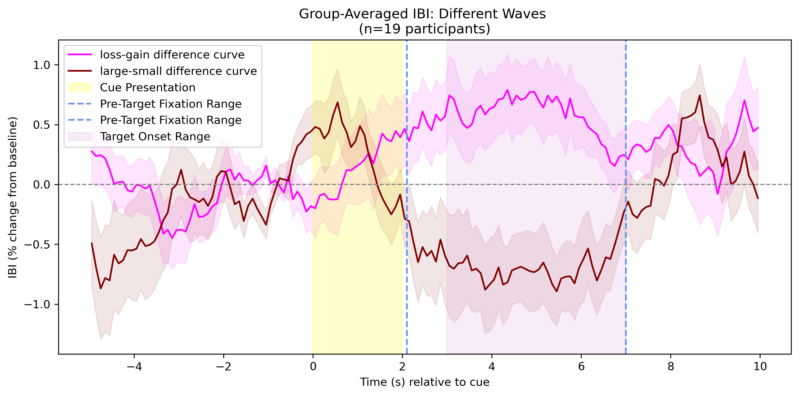

## Target Aligned Analysis Results:
### How does IBI dynamically change around cue presentation in the MID task?¶
* Pre-target anticipatory rise (~ -1 to 0s): IBI gradually increases across the 1s fixation period which may suggest cardiac slowing as participants anticipate the target presentation
* Target and post-target deceleration (~1 to 5s): after the presentation of the target, IBI starts dropping quite rapidly and continues to drop into the IBI period. This indicates that HR increases as a response to the target presentation and feedback presentation.
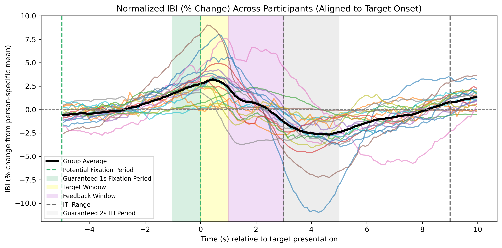

### Do participants' IBI timecourses differ between potential gain and loss trials?
* The IBI timecourse (averaged across participants) is consistent when presented with potential gain or potential loss cue types
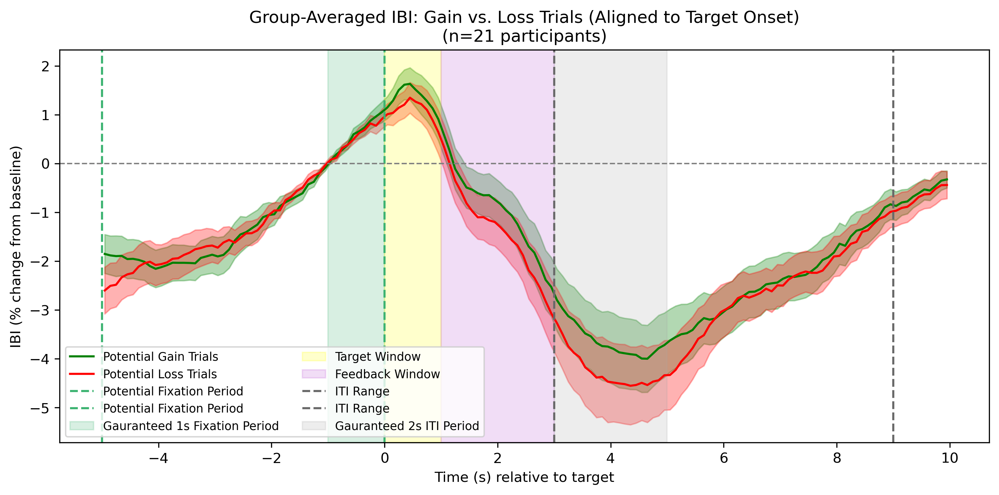

The t-test tests if there is statistically significant difference between the mean IBI in the two different conditions. The t-tests suggest that there is no statistically significant in the mean IBI between gain and loss trials in the 1s target presentation window, nor in the 2s feedback window
* Gain vs Loss IBI During 1s Target Window: t(20) = 1.732, p = 0.0986
* Gain vs Loss IBI During 2s Feedback Period: t(20) = 1.246, p = 0.227

### Do participants' IBI timecourses differ between small and large trial types? 
The plots suggest there is not a big difference in the IBI changes during target presentation or feedback presentation between the small trials (magnitude 1 dollar and 3 dollar) vs the large trials (magnitude7 dollars and 9 dollars). 

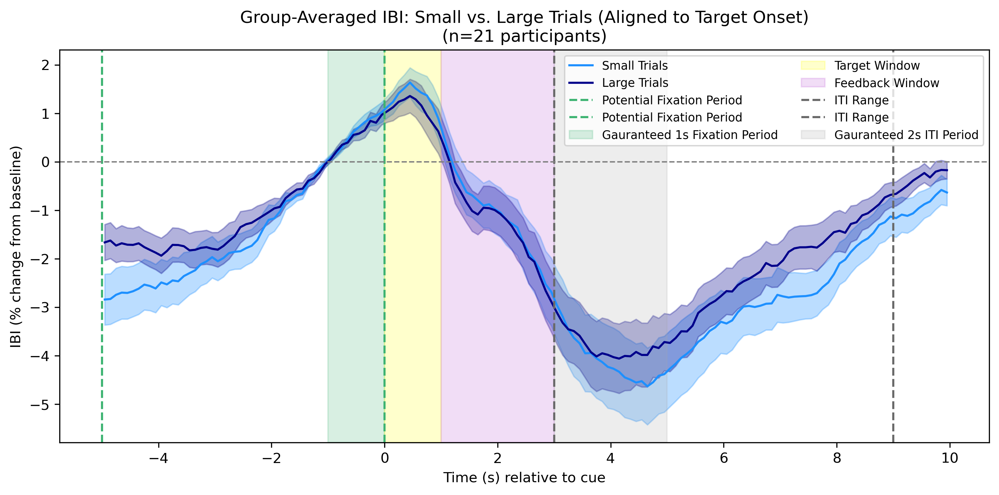

The paired t-test suggests that there are differences between the two groups but not yet at a statistically significant level. 
* Large vs Small IBI During 1s Target Window: t(20) = -0.560, p = 0.581
* Large vs Small IBI During 2s Feedback Period: t(20) = 1.246, p = 0.227

### Do participants' IBI timecourses in the feedback window differ between hit and miss trial types? 
Yes! In the feedback window (purple region), IBI decreases more steeply, suggesting that there may be slightly different physiological responses to hit and miss trials. Heart rate seems to increase more for hit trials versus miss trials in the feedback window. 

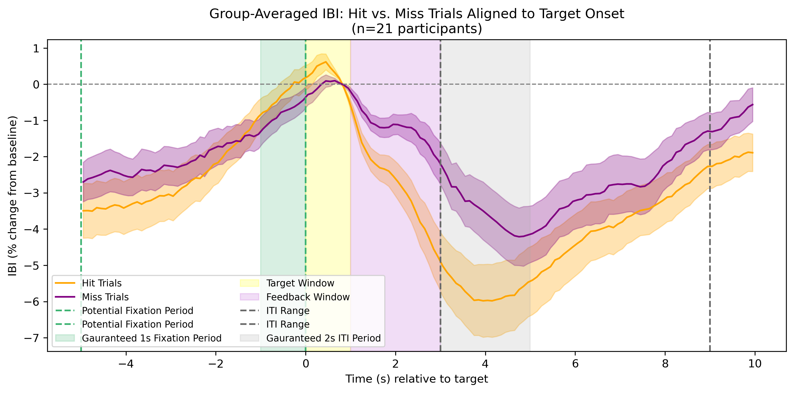

Additionally, the t-test suggests that the mean IBI during the feedback window is different between hit and miss trials at a statistically significant level. 
* Hit vs Miss IBI During 2s Feedback Period: t(20) = 2.505, p = 0.021

### Do difference waves suggest any meaningful effects of cue valence, magnitude, or feedback on the participant-averaged IBI timecourse?
Perhaps yes! To make it easier to compare how heart rate dynamics change over time between trial types, difference curves were created by subtracting one condition’s average IBI timecourse from another (for example, large - small trials). These curves highlight when one condition is changing more quickly than the other, helping summarize how the cardiac response unfolds differently across trial types rather than just comparing overall levels.

The difference curve plot shows that average IBI falls up to 3% faster across the 2s feedback window range when participants see positive feedback (hit) vs negative feedback (miss)
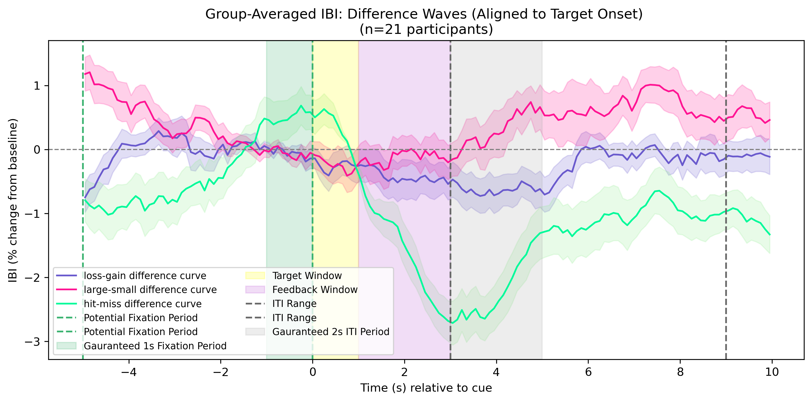

#Behavioral Analyses
## Reaction Time 
### Does RT Drift Across the Session?
Run average and run median RTs stay pretty close to participants' task-median across runs and across participants.

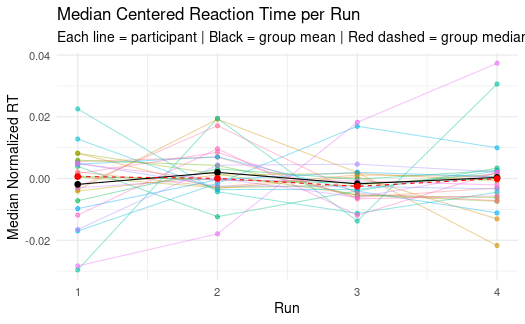

### How do raw reaction time distributions differ across participants in terms of spread and skewness?
The RT distribution across subjects is pretty consistent with the mode peak occurring right before 0.25s and right-skewed tails suggesting a few number of slower reaction times.

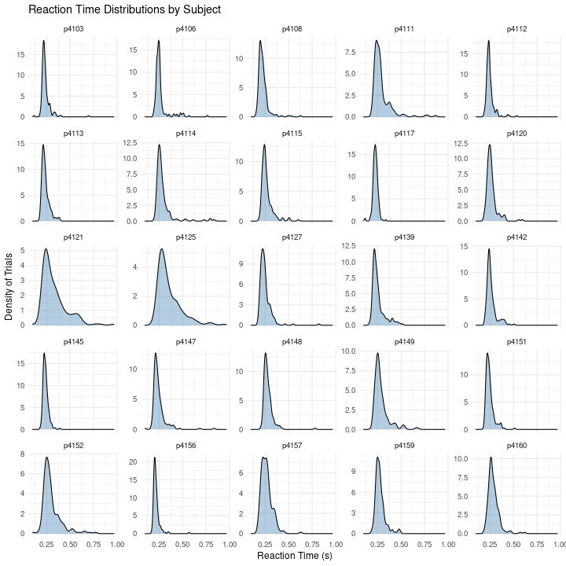

### What do reaction times look like across all participants in this task?
Reaction times across all participants are tightly clustered around a fast central peak (roughly ~250 ms), with a pronounced right-skewed tail extending toward slower responses. Most trials fall within a relatively narrow range of fast reaction times, while a smaller number of trials show substantially slower responses.

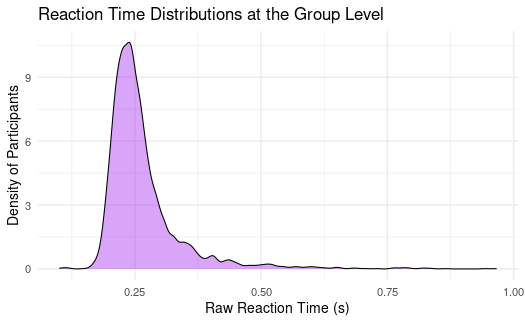

Outliers are very common in RT data collection. When assessing RT patterns at the group level, mean of medians was looked at in order to better tolerate these outliers.

### On average, how do participants’ respond to each different cue magnitudes?
Participants RT may follow a parametric response to cue magnitude – on average, participants took the longest time to responsd to cues that gave them the opportunity to win or lose 1 dollar and responded quickest to cues that gave them the opportunity to win or lose 9 dollars.

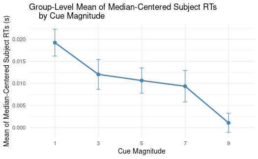

### At the group level, do participants respond differently to cues that indicate the potential to gain money on the upcoming trial vs cues that indicate the potential to lose money on the upcoming trial?
At the group level, participants respond with almost the same speed to potential loss and potential gain trials

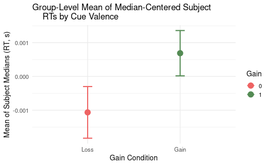

### Do participants respond differently depending on cue type (loss vs gain, and magnitude)?
RTs varies slightly with cue type. Loss cues tend to be associated with slightly slower responses relative to the participants’ median RTs, whereas gain cues are generally associated with slightly faster responses, but there is no meaninful difference standing out.

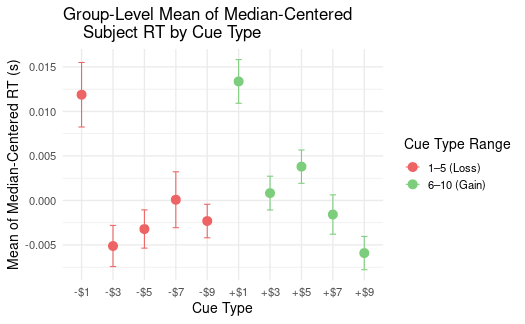

### Is there a linear relationship between cue magnitude and participants’ typical reaction times?

Median reaction time decreased as incentive magnitude increased, indicating faster responses for higher-value cues. Cue magnitude was a significant predictor of reaction time (linear model, p < .001), explaining ~15% of between-condition variance in median RTs.

Full model output avaialable in full_model_outputs folder/RT_cueMag

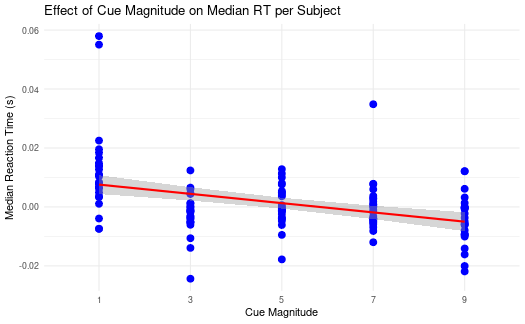

## Slope Sensitivity
We hypothesized that participants differ in how strongly their reaction times change as a function of cue magnitude.To quantify individual differences in sensitivity to cue magnitude, we estimated a participant-specific slope relating reaction time to cue magnitude. More negative slopes indicate greater speeding with increasing cue magnitude, whereas slopes closer to zero indicate weaker cue sensitivity.

### What is the distribution of “cue sensitivity slopes” across participants?
More negative slopes indicate more sensitivity to increasing RTs as cue magnitudes increase where as slopes closer to 0 suggest less cue tendency to respond faster to larger cues.

The bulk of participants show slight sensitivity to increasing cue magnitude. There is not much variability in the distribution of cue magnitude sensitivity across participants.

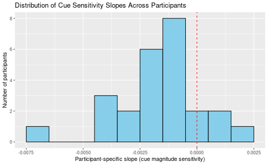

### Is cue sensitivity correlated with higher raw median RT across the task?
Moderately - cue sensitivity is slightly correlated with faster or slower reaction times across the task. Being more sensitive to cue magnitude moderately correlated to having a quicker overall reaction time in the task.

### Is cue sensitivity correlated with winning more trials across the task?
No – there is very little correlation between cue sensitivity and proportion of trials won. This makes sense as the target is calibrated to ensure a consistent 66% success rate across participants.

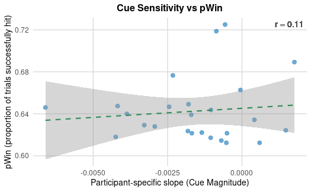

### Is cue sensitivity correlated with mean calibration across the task?
Cue sensitivity may be slightly correlated with mean task calibration. There was a trend that the participants who were more sensitive to cue magnitudes had higher calibration levels. 

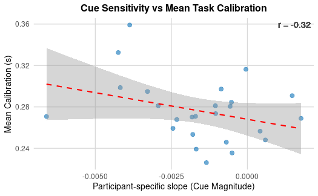

### Is cue sensitivity correlated with total points earned across the task?
Moderately – cue sensitivity is moderately correlated with total points earned. Responding quicker to larger cues is moderately (r=-0.5) correlated to earning more points across the task. 

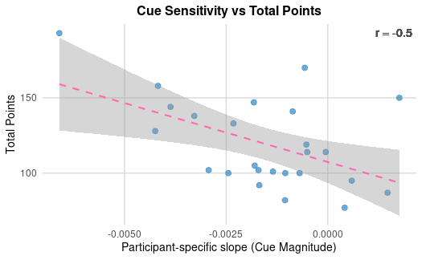

### Are reaction times a function of fixation duration?
Yes- it looks like reaction times decrease (responses happen quicker) as fixation duration increases. This could be a result of the participant being “more are more ready” for the target as the pre-target fixation duration increases.

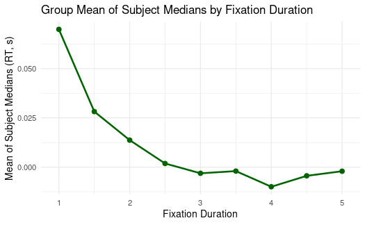

